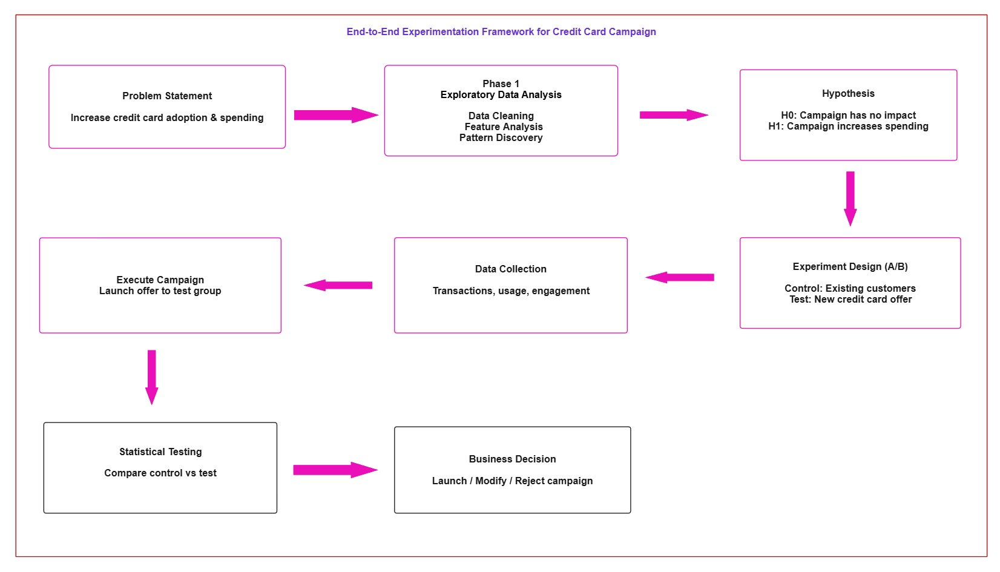

<h1 align="center"> Credit Card Campaign Optimization — A/B Testing</h1>

<p align="center">
  <b> End-to-End Analytics | EDA → Segmentation → A/B Testing → Decision </b>
</p>

<p align="center">
  
  
  
  
  
  
</p>


---

## 🚀 Key Highlights

- Solved a **credit card campaign optimization problem** by identifying high-potential customers for targeted marketing  
- Performed **EDA and segmentation**, uncovering the **18–25 segment as an underserved, high-spending group**  
- Designed and executed a controlled **A/B testing experiment** with proper sample sizing and random assignment  
- Validated campaign effectiveness using **Z-test (Z = 2.75 > 1.645)**, rejecting H₀ and confirming statistically significant impact  
- Confirmed statistical significance using **P-value method (p = 0.003 < 0.05)**, reinforcing reliability of results  
- Delivered a **+6.7% revenue lift**, demonstrating measurable improvement in customer spending  
- Quantified impact using **confidence intervals and effect size (Cohen’s d = 0.49)** to ensure practical significance  
- Achieved ~**40% conversion rate**, indicating strong campaign adoption among targeted customers  
- Enabled a **data-driven decision to scale the campaign**, reducing marketing risk and improving ROI  

---------
  
<p align="center">
  <a href="assets/assets/campaign_architecture.jpg">
    
  </a>
</p>

---

## 🔹 Business Problem

A bank planned to launch a new credit card but faced key risks:

- Poor targeting → low adoption  
- Inefficient marketing → wasted spend  
- No statistical validation → risky decisions  

**Goal:** Identify the best customer segment and validate campaign effectiveness before rollout.

-----

## 🔹 Quantified Impact & Decision Framework

The A/B test demonstrates a clear improvement in customer behavior and confirms the effectiveness of the new campaign with statistically and commercially significant impact

The results were validated using both the **Z-test (critical value method)** and the **P-value method**, ensuring statistical reliability.

### Statistical Validation

- **Z-test:** Z = 2.75 > 1.645 → Reject H₀  
- **P-value:** 0.003 < 0.05 → Reject H₀  

Both methods confirm that the campaign has a **statistically significant positive impact** on customer spending.


### Business Impact

- **+6.7% revenue lift**, indicating a measurable increase in customer spending  
- **Effect size (Cohen’s d = 0.49)** shows meaningful practical impact  
- **95% confidence interval (₹4.24 – ₹25.36)** provides a realistic estimate of expected spend increase  
- **~40% conversion rate** reflects strong customer adoption  

These results demonstrate that the campaign is not only statistically valid but also **commercially effective**.

👉 The campaign demonstrates both statistical significance and measurable business value, making it suitable for risk-aware scaling decisions.

### Decision Logic

The campaign is scaled only when:
- Statistical significance is confirmed (**p-value < 0.05**)  
- Positive business impact is observed (**revenue lift > 0**)  

### Trade-Off Consideration

- **False positive:** Scaling an ineffective campaign leads to wasted marketing spend  
- **False negative:** Rejecting an effective campaign results in missed revenue opportunity  

### Final Decision

Since both statistical tests reject the null hypothesis and the campaign shows strong business impact, it should be **scaled to the 18–25 segment**.

### Recommendation

Proceed with rollout and continuously monitor **conversion rate and revenue lift** to ensure sustained performance and enable further optimization.

---

## 🔹 Dataset

| Dataset | Records | Contents |
|---|---|---|
| Customers | 1,000 | Demographics, profile |
| Credit Score | 1,004 | Credit scores, limits |
| Transactions | 500,000 | Spend behaviour, categories, payment methods |

---

## 🔹 Phase 1 — EDA & Segmentation

- Cleaned and preprocessed all three datasets — handled missing values and outliers
- Analysed spending behaviour across age groups, categories, and payment methods
- Segmented customers by age — identified 18–25 as highest potential

**Key finding:**

| Segment | Share of Base | Credit Card Adoption | Spending Activity |
|---|---|---|---|
| 18–25 | ~25% | Low | High (Electronics, Fashion, Beauty) |
| 26–40 | ~40% | Medium | Medium |
| 40+ | ~35% | High | Low–Medium |

**Insight:** The 18–25 segment is underserved — strong spenders with low card adoption = high-value untapped opportunity.

---

## 🔹 Campaign Architecture
 
 


## 🔹 Phase 2 — Experiment Design

### Hypothesis

| | Statement |
|---|---|
| H₀ | New campaign has no impact on customer behaviour |
| H₁ | New campaign improves spending and engagement |

### Power Analysis

| Parameter | Value |
|---|---|
| Significance level (α) | 0.05 |
| Statistical power | 0.80 |
| Target effect size | 0.40 |
| Required sample size | ~100 per group |

### Group Assignment

| Group | Treatment |
|---|---|
| Control | Existing campaign |
| Test | New credit card campaign |

Customers randomly assigned — ensuring unbiased comparison.

---

## 🔹 Phase 3 — Statistical Testing

<details>
<summary><b>Z-test — critical value method</b></summary>


 **Z-test was used due to sufficient sample size and assumption of normally distributed sample means.**
 
```python
a = (control_std**2 / sample_size)
b = (test_std**2 / sample_size)
z_score = (test_mean - control_mean) / np.sqrt(a + b)
```

| Metric | Value |
|---|---|
| Z-score | 2.75 |
| Critical Z (α=0.05) | 1.64 |
| Decision | 2.75 > 1.645 → ✅ Reject H₀ |

👉 **Decision:** Since the Z-score (2.75) exceeds the critical value (1.645), we reject the null hypothesis (H₀), indicating that the campaign has a statistically significant positive impact.

</details>

<details>
<summary><b>P-value method</b></summary>
 
```python
p_value = 1 - st.norm.cdf(z_score)
```

| Metric | Value |
|---|---|
| P-value | 0.003 |
| Threshold | 0.05 |
| Decision | 0.003 < 0.05 → ✅ Reject H₀ |

👉 **Decision:** Since the p-value (0.003) is less than the significance level (0.05), we reject the null hypothesis, indicating that the campaign has a statistically significant positive impact.

</details>

<details>
<summary><b>Cohen's d — effect size</b></summary>
 
```
Difference in means: 235.98 − 221.18 = 14.80
SD pooled = √((21.36² + 36.66²) / 2) ≈ 30
Cohen's d = 14.8 / 30 ≈ 0.49
```

| Planned Effect Size | Observed Effect Size | Result |
|---|---|---|
| 0.40 | 0.49 | Observed > planned — experiment properly powered ✅ |

👉 **Interpretation:** Medium practical effect — campaign produced a meaningful increase in spending.

</details>

<details>
<summary><b>Confidence interval</b></summary>
 
```
SE = √((21.36²/100) + (36.66²/100)) ≈ 5.39
ME = 1.96 × 5.39 ≈ 10.56
CI = 14.8 ± 10.56 → (4.24, 25.36)
```

👉 **Interpretation:** We are 95% confident the campaign increases average spend by **₹4.24 to ₹25.36** per customer.

</details>

<details>
<summary><b>Revenue lift</b></summary>
 
```
Lift = ((235.98 − 221.18) / 221.18) × 100 ≈ 6.7%
```

👉 **Interpretation:** The campaign increased average customer spending by **6.7%** compared to the control group.

</details>


---

## 🔹 Project Structure
```
ab-testing-campaign/
│
├── notebooks/
│   ├── 01_eda_segmentation.ipynb      # EDA and age group analysis
│   └── 02_ab_testing.ipynb            # Experiment design and testing
│
├── data/                              # Raw datasets (not included — NDA)
├── requirements.txt
├── README.md
└── .gitignore
```

---

## 🔹 Challenges

- **Sample size constraint** — 100 per group is small; power analysis upfront ensured the test was sensitive enough to detect the target effect
- **One-tailed vs two-tailed** — chose right-tailed test since the hypothesis was directional (improvement, not just difference)
- **Effect size interpretation** — Cohen's d alone doesn't tell the business story; pairing it with revenue lift made the result actionable

  -----

## 🔹 Future Improvements

- Increase sample size (500+) to improve statistical power and detect smaller effect sizes more reliably  
- Extend to **multi-variant testing (A/B/C)** to identify the most effective campaign strategy  
- Build an **automated monitoring pipeline** to track post-rollout performance (spend, conversion, churn) and detect campaign decay  

  ----

**Author:** Sree Varshan  
Data Science & AI | Machine Learning | Financial Domain  

⭐ If you found this project useful, feel free to star the repository.

